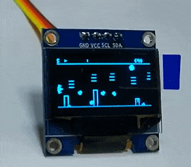
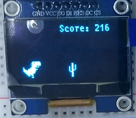
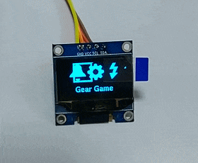
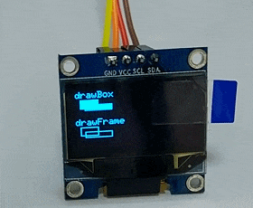
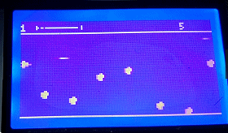
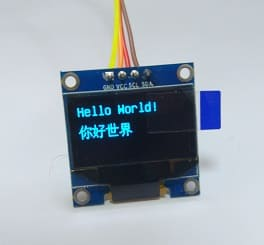
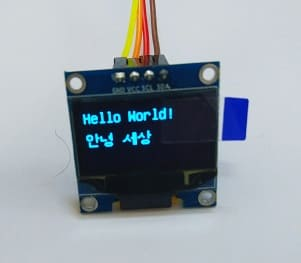
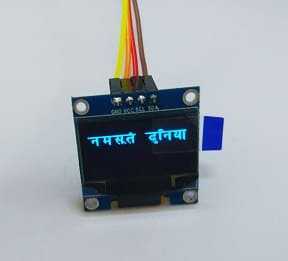
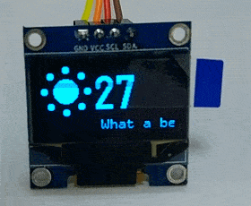
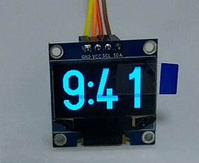

> 这个仓库是我以前移植 u8g2 到 RT-Thread 的版本，现在对应的移植已经 upstream 到 u8g2 的官方仓库了，所以可以直接用官方仓库了。 - 2021.09.30

# rt-u8g2

## 0、介绍

u8g2 原先是 Arduino 平台上的一个单色屏驱动，现在移植到了 rt-thread，可以满足各种各种各样的需求。

> 游戏开发 (examples/games/space_trash)

> 用户界面 (examples/page_buffer/icon_menu)

> 绘图 (examples/page_buffer/graphic_test)

## 1、U8G2 特点

#### 1.1 支持屏幕多，移植方便

使用 u8g2 的好处在于它支持近 200 种单色屏，同样的代码可以直接运行在不同的屏幕上，比如前面的游戏可以在各种屏幕上运行：

> 经典 128x64

> OLED SSD1306 I2C

在这里可以看到所有支持的屏幕：

[https://github.com/olikraus/u8g2/wiki/gallery](https://github.com/olikraus/u8g2/wiki/gallery)

#### 1.2 支持字体多

> 中文

> 韩文

> 日文

> 梵文

#### 1.3 绘图函数多

支持各种绘图函数，而且自带各种 icon

总结一下 u8g2 的特点：  

- 支持近 200 种单色屏，移植方便
- 支持各种绘图函数、图像与非操作，自带用户按键检测
- 支持 unicode 和 utf8，自带 100 多种字体和 100 多个 icon

## 2、项目说明
### 2.1 目录结构

> 说明：目录结构

| 名称 | 说明 |
| ---- | ---- |
| docs  | 文档目录 |
| examples | 例子目录|
| src  | 源代码目录 |
| port | 针对特定平台的移植代码目录 |

### 2.2 许可证

- The U8g2lib code (http://code.google.com/p/u8g2/) is licensed under the terms of 
the new-bsd license (two-clause bsd license).  See also:  

		http://www.opensource.org/licenses/bsd-license.php  

- The repository and optionally the releases contain icons, which are
derived from the WPZOOM Developer Icon Set. WPZOOM Developer Icon Set by WPZOOM is licensed under a Creative Commons 
Attribution-ShareAlike 3.0 Unported License.  

		http://www.wpzoom.com/wpzoom/new-freebie-wpzoom-developer-icon-set-154-free-icons/ 

- Fonts are licensed under different conditions.for detailed information on the licensing conditions for each font.

		https://github.com/olikraus/u8g2/wiki/fntgrp

Check full LICENCE **[here](LICENSE)**.

### 2.3 项目依赖

说明：如果使用 I2C 液晶屏需要开启 I2C，GPIO 模拟 I2C 。

- Using I2C device drivers
- Use GPIO to simulate I2C

说明：如果使用 SPI 液晶屏需要开启 SPI 。

- Using SPI Bus/Device device drivers

## 3、如何使用 U8G2

使用 u8g2 package 需要在 RT-Thread 的包管理器中选择它，具体路径如下：

	RT-Thread online packages
		peripheral libraries and drivers --->
	    	[*] U8G2: a u8g2 package for rt-thread
	            [*] Use hardware spi                                     
	              (spi1)  spi bus name (NEW)              
	              (spi10) spi device name (NEW)     
	            [*] Use hardware i2c          
	              (i2c2)  i2c device name
	            U8G2 Examples  --->

然后让 RT-Thread 的包管理器自动更新，或者使用 `pkgs --update` 命令更新包到 BSP 中。

一共有50个例程，可以在源码 docs 目录下看到预览图。默认的例程都是用的软件I2C，如果觉得速度比较慢可以使用硬件I2C。

## 4、注意事项

- 默测试认使用 STM32F103，如果要使用到其他平台，请参照 [移植说明](port/README.md)，不过只要用的 RT-Thread 应当不需要额外的移植。
- 请使用 stm32 目录下的 bsp
- 编译需要开启 -std=c99
- 如果编译发现 flash 不够大，可以打开优化选项 -O3 或者参照 [这里](https://github.com/olikraus/u8g2/wiki/u8g2optimization) 去掉多余的字库
- 完整的 API 手册可以访问这个 [链接](https://github.com/olikraus/u8g2/wiki/u8g2reference)
- 其他 [常见问题 FAQ](https://github.com/wuhanstudio/rt-u8g2/issues)

## 5、感谢

- u8g2: https://github.com/olikraus/u8g2

## 6、联系方式

* 维护：Wu Han
* 主页：http://wuhanstudio.cc
* 联系：https://github.com/wuhanstudio/rt-u8g2/issues
